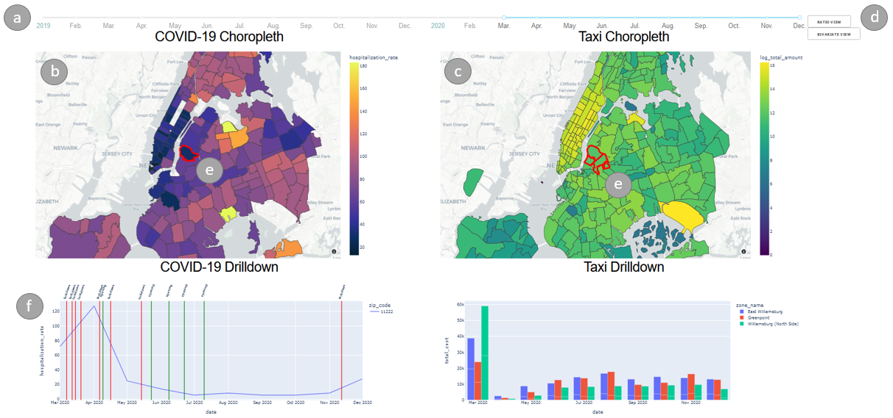

# CS889 project

A dashboard to examine the impact of COVID-19 on the NYC Taxi Industry

|  |
|:--:|
| Major components of our dashboard: a) Date range slider; b) Choropleth map of COVID data; c) Choropleth map of taxi revenue data; d) Buttons for changing the view of the taxi data map; e) Highlighting of zip code areas and taxi zones based on user interaction; f) Drilldown of location-specific data |

## Commands to run

Plotly 5.1.0 is required.

```bash
git clone git@github.com:wxli0/CS889Project.git
cd CS889Project
python app.py
```
